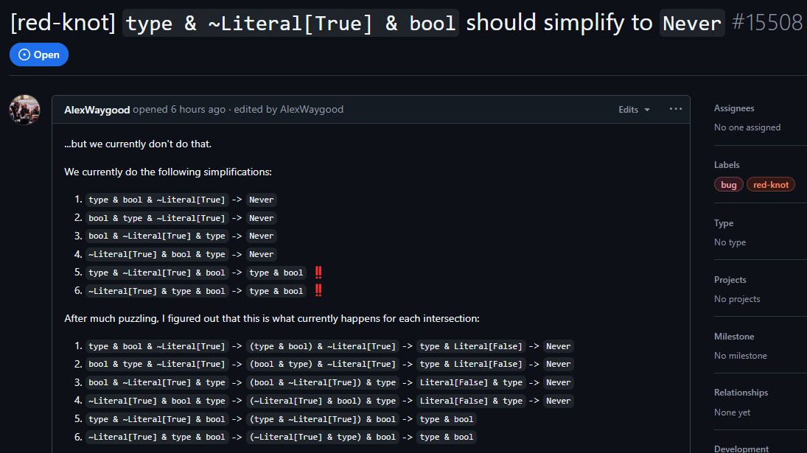

<!--
class:
- invert
headingDivider: 2 
paginate: true
-->

<style>
    .labels {
        position: absolute;
        display: flex;
        gap: 0.5rem;
        top: 1rem;
    }

    .labels .beginner, .labels .intermediate, .labels .advanced {
        font-size: 0.5rem;
    }

    .beginner {
        color:rgb(0, 191, 255);
    }
    .beginner::after {
        content: "beginner";
    }

    .intermediate {
        color: #90EE90;
    }
    .intermediate::after {
        content: "intermediate";
    }

    .advanced {
        color: #D70040;
    }
    .advanced::after {
        content: "advanced";
    }
</style>

# What (not) to do when type hinting Python?

16.01.2025
PyWaw #117

<style scoped>
    .to-right {
        text-align: right;
    }
</style>

<div class="to-right">

by Bartosz Sławecki ([@bswck](https://github.com/bswck))
Junior Python Engineer @ [Printbox](https://getprintbox.com/)
</div>

## Check-in
<center>


</center>

## Special thanks

Shoutout to:
- Carl Meyer, for helping me understand the type theory
- a user named `decorator-factory`, for helping me understand the true purpose of this presentation
- Jelle Zijlstra, for participating in the discussion about my talk
- everyone else involved who encouraged me in this endeavor

# Who is this talk for?

Everyone!
And  _especially_ for you, if you:
- are interested in using typing and have no prior practice (<code class="beginner"></code>)
- occasionally use typing, but not a lot (<code class="intermediate"></code>)
- already use typing extensively and maybe like it (<code class="advanced"></code>)

## What is typing in Python all about?
<div class="labels">
    <code class="beginner"></code>
</div>

It's about describing what sets of runtime values can reside in particular variables.

## What is type hinting in Python all about?
<div class="labels">
    <code class="beginner"></code>
</div>

Type hinting is as simple as turning

<style scoped>
    .flex {
        display: flex;
        gap: 1rem;
        width: 40rem;
        justify-content: space-between;
        align-items: center;
    }

    .flex pre {
        width: 30rem;
    }
</style>

<div class="flex">

```py
def cube_area(e):
    return f"Cube area: {6 * e ** 2}."
```

into

```py
def cube_area(e: float) -> str:
    return f"Cube area: {6 * e ** 2}."
```
</div>

# If you're starting out
<div class="labels">
    <code class="beginner"></code>
</div>

Let's learn about two main kinds of types really quickly.

## Don't forget about these useful *go-to*s

<div class="labels">
    <code class="beginner"></code>
    <code class="intermediate"></code>
    <code class="advanced"></code>
</div>

- [Python type system specification](https://typing.readthedocs.io/en/latest/)
- [`typing` standard library docs](https://docs.python.org/3/library/typing.html)
- [relevant PEPs](https://peps.python.org/topic/typing/)
- [typeshed](https://github.com/python/typeshed)
- docs of particular type checkers ([mypy](https://mypy.readthedocs.io/en/stable/), [pyright](https://microsoft.github.io/pyright/#/), et alia)
- Python docs
- YouTube videos from [Anthony Sottile](https://www.youtube.com/@anthonywritescode), [James Murphy](https://www.youtube.com/@mCoding), [me](https://www.youtube.com/@Codezarre) et alia

## Check out various different type checkers
<div class="labels">
    <code class="beginner"></code>
    <code class="intermediate"></code>
    <code class="advanced"></code>
</div>

- [mypy](https://mypy.readthedocs.io/en/stable/) (esp. recommended for <code class="beginner"></code>s)
- [pyright](https://microsoft.github.io/pyright/#/) (esp. recommended for <code class="beginner"></code>s)
- [pyre](https://pyre-check.org/)
- [pytype](https://google.github.io/pytype/)

## When would you use mypy?
<div class="labels">
    <code class="beginner"></code>
    <code class="intermediate"></code>
    <code class="advanced"></code>
</div>

- You want to stick with the most popular option
- You want to compile your code with [`mypyc`](https://mypyc.readthedocs.io/en/latest/index.html) to C extensions (~2.5x speedup)

Docs: https://mypy.readthedocs.io/en/stable/

## When would you use pyright?
<div class="labels">
    <code class="beginner"></code>
    <code class="intermediate"></code>
    <code class="advanced"></code>
</div>

- You use Pylance in VS Code
- You like pyright's approach, design decisions and behaviors that differ from mypy's

Docs: https://microsoft.github.io/pyright/, [comparison with mypy](https://microsoft.github.io/pyright/#/mypy-comparison?id=differences-between-pyright-and-mypy)

## When would you use Pyre?
<div class="labels">
    <code class="intermediate"></code>
    <code class="advanced"></code>
</div>

- You want to check out the type checker used for linting Instagram
- You've heard about [Pysa](https://pyre-check.org/docs/pysa-basics/) and want to test it too

Docs: https://github.com/facebook/pyre-check
Some background: https://news.ycombinator.com/item?id=17048682

## When would you use pytype?
<div class="labels">
    <code class="intermediate"></code>
    <code class="advanced"></code>
</div>

- You prefer lenient type checking
- You want to rely more on type inference than on explicit annotations
  (no _gradual typing_)

Docs: https://google.github.io/pytype/, [comparison with mypy](https://google.github.io/pytype/#how-is-pytype-different-from-other-type-checkers)

# It's not everything...

## Coming soon: [red-knot](https://github.com/astral-sh/ruff/milestone/20)
<div class="labels">
    <code class="beginner"></code>
    <code class="intermediate"></code>
    <code class="advanced"></code>
</div>

<div class="small">

From [Astral](https://astral.sh/), the team behind [Ruff](https://docs.astral.sh/ruff/) and [uv](https://docs.astral.sh/uv/)
</div>

<style scoped>
    img {
        width: 30rem;
    }

    .small {
        font-size: 0.7rem;
    }
</style>

<center>


</center>

## ...and if you like rabbit holes,
<div class="labels">
    <code class="advanced"></code>
</div>

check out those: [basedmypy](https://kotlinisland.github.io/basedmypy/), [basedpyright](https://github.com/DetachHead/basedpyright), [pyanalyze](https://pyanalyze.readthedocs.io/en/latest/faq.html)

## To conclude,

<style scoped>
    img {
        width: 25rem;
        padding-top: 1rem;
    }
</style>

<center>


</center>

# Typing: a strategy that works

<div class="labels">
    <code class="beginner"></code>
    <code class="intermediate"></code>
</div>

# Typing: a strategy that works*

<div class="labels">
    <code class="beginner"></code>
    <code class="intermediate"></code>
</div>

# Typing: a strategy that works*

<div class="labels">
    <code class="beginner"></code>
    <code class="intermediate"></code>
</div>

*on my machine

# Typing: a strategy that works

<div class="labels">
    <code class="beginner"></code>
    <code class="intermediate"></code>
</div>

For every typing feature, do the following:

0. Learn about it
1. Gradual introduction (remember about [chunking and aliasing](https://www.youtube.com/watch?v=UANN2Eu6ZnM))
2. Troubleshooting (optionally, _trouble-shouting_) / Getting it right
3. Staying up to date (but not up late)

## Learn about it
<div class="labels">
    <code class="beginner"></code>
    <code class="intermediate"></code>
</div>

Example: From a linter

## Gradual introduction
<div class="labels">
    <code class="beginner"></code>
    <code class="intermediate"></code>
</div>
Example: Adding types to my code from 4 years ago

## Troubleshooting / Getting it right
<div class="labels">
    <code class="beginner"></code>
    <code class="intermediate"></code>
</div>

- Work through the errors reported by your type checker
- Don't be afraid to google things
- Suggest improvements to type checkers / File bug reports
- Ask questions in [Python Discord](https://discord.com/invite/python)'s [`#type-hinting`](https://discord.com/channels/267624335836053506/891788761371906108)

## Staying up to date
<div class="labels">
    <code class="beginner"></code>
    <code class="intermediate"></code>
    <code class="advanced"></code>
</div>

- Follow the changelogs (or [videos about them](https://www.youtube.com/watch?v=mvJuxowIwIc))
- Subscribe to Codezarre (https://codezarre.com—try to print this website)

## Want to dabble even more?
<div class="labels">
    <code class="intermediate"></code>
    <code class="advanced"></code>
</div>

- [Read the new typing PEPs](https://peps.python.org/topic/typing/)
- [Participate in typing discussions!](https://discuss.python.org/c/typing/32)
- Contribute to typing-related projects or create them!
  - https://github.com/bswck/class_singledispatch
  - https://github.com/bswck/runtime_generics
  - https://github.com/alexmojaki/eval_type_backport


# To avoid common pitfalls...
<div class="labels">
    <code class="intermediate"></code>
</div>

## Mentally separate the typing world from the runtime world
<div class="labels">
    <code class="intermediate"></code>
</div>

Typing and runtime have their own, sometimes discrepant rules.
In the end, it's the runtime that matters.

<style scoped>
.examples {
    display: flex;
    padding-top: 1rem;
    justify-content: space-evenly;
    gap: 1rem;
}

pre {
    width: 100%;
}

</style>

<div class="examples">

```py
# passes type checking
x: complex = True

# fails at runtime
assert isinstance(x, complex)

# passes type checking
message: str = NotImplemented

# fails at runtime
assert isinstance(message, str)
```

```py
from typing import TYPE_CHECKING

if TYPE_CHECKING:
    # analyzed by type checkers
    # never executed at runtime
    from circular import something
    from costly import just_for_types
else:
    # always executed at runtime
    # ignored by type checkers
    something very hacky!
```
</div>

## Think about types, not classes
<div class="labels">
    <code class="intermediate"></code>
</div>

> In Python, classes are object factories defined by the `class` statement, and returned by the `type(obj)` built-in function. Class is a dynamic, runtime concept.

Classes are commonly used to create:
- Nominal types (e.g. `str`)
- Structural types (`TypedDict` constructs, `Protocol`s)

Besides that, there are...
- Special forms (e.g. `Never`, `Literal`, `Generic`, `TypedDict`)
- _Weird_ types (e.g. `None`, `NotImplemented`, `NewType`)

## Understand the subtyping relation
<div class="labels">
    <code class="intermediate"></code>
    <code class="advanced"></code>
</div>

The Liskov substitution principle.

We have a function `compute_salary(e: Employee)`.
It accepts an argument of type `Employee`.
Does it also accept an argument of type `Manager`,
given that `Manager` is a subtype of `Employee`?

## Practice the S from SOLID
<div class="labels">
    <code class="advanced"></code>
</div>

Don't make others narrow down your types.
Have an async function? Create a separate coroutine function.
Have a sync function? Create a separate function.

Not both at the same time ;)

# What I like about strict static typing in Python
<div class="labels">
    <code class="intermediate"></code>
    <code class="advanced"></code>
</div>

Opinionated section.

## Autocompletions are very helpful
<div class="labels">
    <code class="beginner"></code>
    <code class="intermediate"></code>
    <code class="advanced"></code>
</div>

- Easier learning of available functionality
- Thinking about developer experience => Faster development in the long run

## Explicit type hinting feels PEP 20-ish
<div class="labels">
    <code class="beginner"></code>
    <code class="intermediate"></code>
    <code class="advanced"></code>
</div>

```py
import this
```

```py
def foo() -> int:
    return 5
```

writing the `-> int` ensures you always return `int`,
and not a supertype or other incompatible type.

## Hacking and golfing are costly
<div class="labels">
    <code class="intermediate"></code>
    <code class="advanced"></code>
</div>

- You are encouraged to rely on single-purpose and statically known constructs
- The code structure can be fairly simpler to be understood by the type checker

## You need a good reason to lie
<div class="labels">
    <code class="advanced"></code>
</div>

...otherwise don't.

Good reasons:
- the impossibility of expressing a type in the current type system
- lack of ergonomicity to specifying the correct type
- DX—see Werkzeug proxies! (`flask.g`, `flask.request`)

Some great projects do lie, so just be sure to have reasons if you need to.

# Things to study
<div class="labels">
    <code class="intermediate"></code>
    <code class="advanced"></code>
</div>

That's your homework assignment!
https://github.com/bswck (pinned repo)

## New features
<div class="labels">
    <code class="intermediate"></code>
    <code class="advanced"></code>
</div>

- Use `typing.Self` (3.11+) or `typing_extensions.Self` (3.9+) for methods returning `cls`/`self`.
- Leverage PEP 696 (`Generator[int, None, None]` -> `Generator[int]`) to reduce redundancy.
- Type hint using generic built-in types (3.9+, PEP 585). E.g. use `list[str]`, not `typing.List[str]`.
- Use `X | Y` instead of `typing.Union[X, Y]` in 3.10+ codebases (PEP 604). This applies to `typing.Optional`, too!
- Don't use `dict[str, Any]` for annotating fixed-structure data (use `TypedDict`, dataclasses, or other models instead).

## New features
<div class="labels">
    <code class="intermediate"></code>
    <code class="advanced"></code>
</div>

- Review your `TypeGuard`s that could be `TypeIs`s. See ([TypeIs vs TypeGuard](https://mypy.readthedocs.io/en/latest/type_narrowing.html#typeis-vs-typeguard) and [PEP 742](https://peps.python.org/pep-0742/)).
- Don't bother using `TYPE_CHECKING` in a module where any of your types are evaluated at runtime (e.g. in Pydantic models).
- Be pragmatic about `TYPE_CHECKING`. Use it to optimize import times, avoid circular imports and import symbols from stubs.

## General
<div class="labels">
    <code class="intermediate"></code>
    <code class="advanced"></code>
</div>

- Don't confuse `Any` with `object` (check [this](https://pyre-check.org/docs/types-in-python/#about-object)).
- Don't use `Any` as an easy way to type a hard-to-annotate interface. Read [how to move away from `Any`](https://pyre-check.org/docs/types-in-python/#how-to-move-away-from-any).
- Don't use the deprecated aliases from `typing`.
- Try not to have to use overloads, but use them to logically associate call conventions, especially when unions are involved.
- Use stub files for annotating extension modules.

## Opinionated
<div class="labels">
    <code class="intermediate"></code>
    <code class="advanced"></code>
</div>

- DON'T use bare `# type: ignore` (this applies also to `# noqa`).
- DON'T skip annotating return values ([here's a writeup](https://github.com/jaraco/skeleton/issues/98#issuecomment-1812838723)).
- DO allow yourself to use PEP 563 despite future deprecation.
- DO prefer `typing.Never` to `typing.NoReturn` (no difference).
- Avoid `T | Awaitable[T]` (`T | Coroutine[T, None, None]`). Single responsibility and interface segregation.

## Opinionated (for libraries)
<div class="labels">
    <code class="intermediate"></code>
    <code class="advanced"></code>
</div>

- DO type-check at tail (minimum supported version) or all supported versions (to cover `if sys.version_info` branches).
- DO use `__all__` to control re-exports.
- DO minimize runtime overhead if using inlined types. E.g. [this PR](https://github.com/Textualize/textual/pull/4659)

# Wrapping up
https://github.com/bswck (pinned repo)

# Share your feedback

<style scoped>
    img {
        width: 40%;
    }
</style>

<center>


</center>